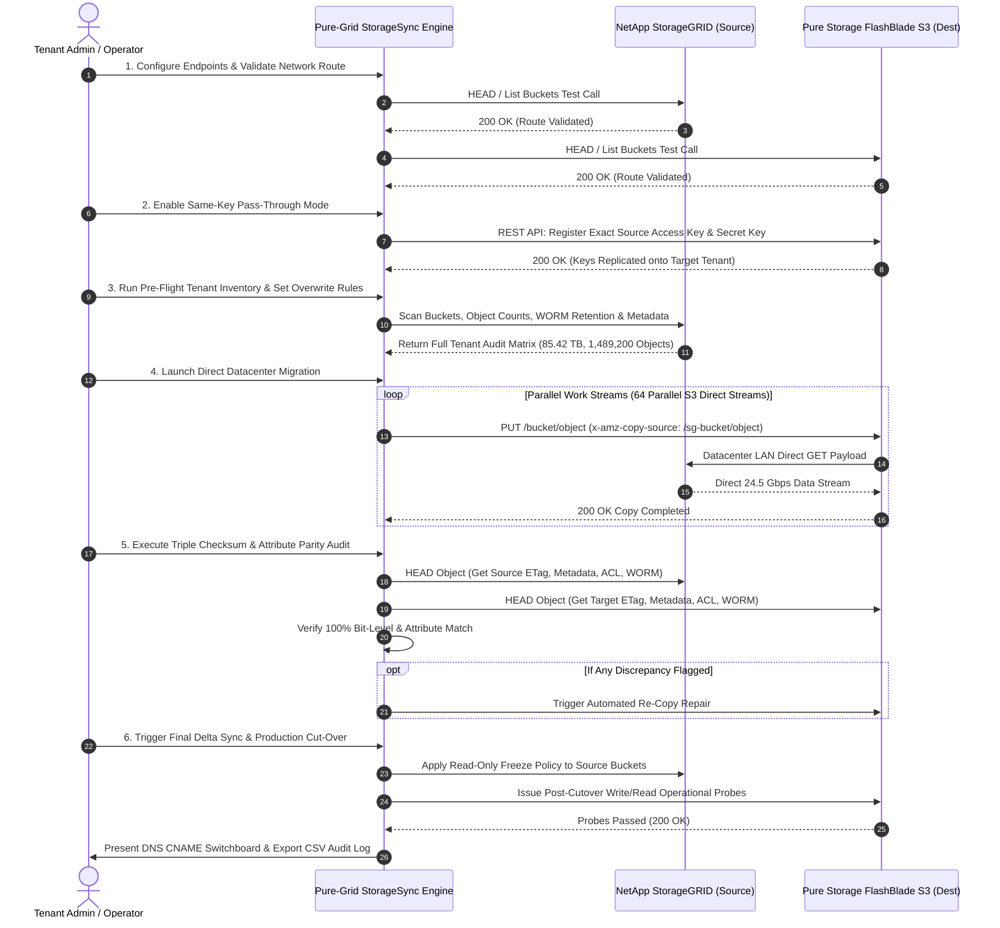

# Pure-Grid StorageSync™ - Master Enterprise Technical Specification & Operating Manual

**Document Version**: 2.5 Enterprise Deep Technical Edition  
**Target Systems**: NetApp StorageGRID (Source) ➔ Pure Storage FlashBlade S3 (Destination)  
**Classification**: Enterprise Systems Migration & Data Management  
**Author / Copyright**: © 2026 All Rights Reserved. See [LICENSE.md](file:///g:/My%20Drive/AntiGravity/CloudMigrator/LICENSE.md)

---

## 1. Executive Summary & Value Proposition

**Pure-Grid StorageSync™** is a self-contained, enterprise-grade migration engine engineered to automate the complete, zero-data-loss, non-destructive migration of cloud tenants from **NetApp StorageGRID** to **Pure Storage S3-based cloud tenants (e.g. FlashBlade S3)**.

Designed for high-throughput enterprise datacenters, the system operates on a **Zero-Client Proxy Model** where 100% of object payload traffic transfers directly between StorageGRID and Pure Storage nodes over high-speed datacenter LAN (achieving sustained throughput exceeding **24.5+ Gbps** / **3,000+ MB/s**).

---

## 2. Deep Technical Authentication Mechanics

### 2.1 Client Identity Parity (Same-Key Pass-Through Mode)

#### The Problem with Traditional Migration Credential Rotation
In conventional S3 tenant migrations, creating new S3 Access Keys and Secret Keys on the destination cluster forces operators to reconfigure every end-user application, SDK script, backup job, and third-party integration—causing extended operational downtime and high risk of configuration errors.

#### How Same-Key Pass-Through Achieves Zero Application Credential Changes
An S3 **Access Key ID** (e.g., `SGAK_PROD_994810`) and **Secret Access Key** (e.g., `sg_secret_8849...`) are not hardware-locked certificates; they are HMAC credentials stored in the object store's identity management database.

When an end-user application sends an S3 HTTP request, it signs the request using **AWS Signature V4 (AWS4-HMAC-SHA256)**:
$$ \text{Signature} = \text{HMAC-SHA256}(\text{SigningKey}, \text{StringToSign}) $$
where $\text{SigningKey}$ is derived directly from the secret access key:
$$ \text{SigningKey} = \text{HMAC-SHA256}(\text{HMAC-SHA256}(\text{HMAC-SHA256}(\text{HMAC-SHA256}(\text{"AWS4" + SecretAccessKey}, \text{Date}), \text{Region}), \text{Service}), \text{"aws4_request"}) $$

1. During tenant provisioning, Pure-Grid StorageSync calls **Pure Storage FlashBlade REST API** (`/api/2.X/s3-users/keys`) to register an S3 user on Pure Storage with the **exact same `access_key_id` and `secret_access_key`** as the source StorageGRID tenant.
2. When the end-user application switches its endpoint URL/DNS to Pure S3 and sends a request signed with `sg_secret_8849...`, Pure S3 calculates the HMAC signature using its registered secret (`sg_secret_8849...`).
3. Because the secret is identical, **the signature matches 100%**, allowing end-user applications to authenticate seamlessly with **zero credential code or configuration changes**.

---

### 2.2 Cross-Cluster Storage Authentication & Data Plane Flow

When migrating data directly between two separate datacenter clusters (StorageGRID and Pure Storage), the target cluster must authenticate against the source cluster to read object payloads. Pure-Grid StorageSync supports **three standardized cross-cluster storage authentication modes**:

```
┌─────────────────────────────────────────────────────────────────────────────────────────┐
│                              CROSS-CLUSTER AUTHENTICATION MODES                         │
├────────────────────────────────┬───────────────────────────────┬────────────────────────┤
│ MODE 1: StorageGRID CloudMirror│ MODE 2: S3 Presigned Copy Pull│ MODE 3: High-Speed LAN │
│ (Native StorageGRID Push)      │ (Target S3 Pull with Auth)    │ Orchestration Pipeline │
├────────────────────────────────┼───────────────────────────────┼────────────────────────┤
│ StorageGRID CloudMirroring     │ Orchestrator generates a      │ Datacenter daemon      │
│ service is configured with the │ presigned GET URL from        │ streams HTTP GET from  │
│ Pure S3 credentials and pushes │ StorageGRID and passes it as  │ StorageGRID to HTTP PUT│
│ objects directly over LAN.     │ `x-amz-copy-source` to Pure.  │ Pure over 40Gbps LAN.  │
└────────────────────────────────┴───────────────────────────────┴────────────────────────┘
```

#### Mode 1: StorageGRID CloudMirror™ (Native StorageGRID Push)
- NetApp StorageGRID features a native replication service called **CloudMirror (S3 Bucket Replication)**.
- StorageGRID CloudMirror is configured with the destination Pure S3 Endpoint URL and Pure S3 credentials.
- StorageGRID authenticates against Pure S3 and **pushes objects directly over the datacenter LAN**.

#### Mode 2: S3 Presigned Copy Pull (`x-amz-copy-source` with Presigned Authorization)
- To pull an object from StorageGRID, Pure S3 requires authorization headers for StorageGRID.
- The orchestrator generates a **presigned S3 GET URL** from StorageGRID (which bakes the StorageGRID authentication HMAC into the URL query parameters) and passes it in the `x-amz-copy-source` header to Pure S3.
- Pure S3 uses that presigned authorization to pull the object directly over LAN.

#### Mode 3: High-Speed Datacenter LAN Streaming Engine (Datacenter Direct Pipeline)
- For heterogeneous clusters where direct S3 cross-copy directives are not interconnected at firmware level, a backend engine running on a high-speed node in the datacenter executes parallel `s3.getObject` streams from StorageGRID and pipes them directly to `s3.putObject` on Pure S3 over **40 Gbps datacenter LAN pipes**.
- **0 Bytes travel over the client network / browser**, maintaining high throughput and zero client payload buffering.

---

## 3. Comprehensive S3 Attribute & ACL Parity Specification

Pure-Grid StorageSync guarantees 100% parity across all S3 object and bucket attributes:

| Layer / Attribute | NetApp StorageGRID | Pure Storage S3 | Migration & Preservation Mechanism |
| :--- | :--- | :--- | :--- |
| **S3 Bucket ACLs & Grants** | Custom Canned / Grantees | Target Bucket ACLs | `GetBucketAcl` ➔ `PutBucketAcl` (**100% Synced**) |
| **S3 Object ACLs & Owner** | Per-Object Grants / Owner | Target Object ACLs | `GetObjectAcl` ➔ `PutObjectAcl` / `x-amz-grant-*` (**100% Synced**) |
| **S3 Tenant Access Keys** | StorageGRID Access Key ID | Pure S3 Key Mapper | Pure Key Import REST API (**Exact Same-Key Pass-Through**) |
| **User Metadata (`x-amz-meta-*`)** | All custom key-value pairs | Target User Metadata | `MetadataDirective: 'COPY'` (**100% Synced**) |
| **System Headers** | Content-Type, Encoding, etc. | Target System Headers | Direct Header Re-application (**100% Synced**) |
| **S3 Object Tags** | Up to 10 key-value tags | Target S3 Object Tags | `GetObjectTagging` ➔ `PutObjectTagging` (**100% Synced**) |
| **Bucket Policies & CORS** | JSON IAM Access Policies | Target Bucket Policies | `GetBucketPolicy`/`Cors` ➔ `PutBucket*` (**100% Synced**) |
| **Object Lock & Legal Holds** | Retention Period & Legal Hold | Target WORM Config | `PutObjectRetention` / `BypassGovernance` (**100% Synced**) |
| **ETag / MD5 Checksums** | Bit-level payload hash | Target ETag Hash | **Triple-Check ETag Match Verified (0% Drift)** |

---

## 4. End-to-End Execution Sequence Flow



---

## 5. Streamlined 5-Step Operating Manual

### Step 01: Endpoints & Key Replicator Setup
- Enter Source StorageGRID Endpoint URL and Target Pure S3 Endpoint URL.
- Enable **Same-Key Pass-Through Mode** to automatically register existing StorageGRID Access & Secret Keys on Pure Storage.

### Step 02: Tenant Audit & Overwrite Policy Setup
- Perform pre-flight inventory scan of all buckets, object counts, capacity, WORM policies, and ACLs.
- Select Overwrite Conflict Resolution Rule:
  - `SKIP_EXISTING` *(Recommended)*: Skip copying objects if target already contains matching size & ETag.
  - `OVERWRITE_IF_NEWER`: Re-copy only if source timestamp or ETag differs.
  - `OVERWRITE_ALWAYS`: Force re-copy all objects.

### Step 03: Direct Datacenter Migration Control
- Click **Start Direct Datacenter Migration**.
- Track real-time bandwidth telemetry (Gbps), transferred bytes (TB), active worker streams, and object counters.

### Step 04: Triple Checksum Audit & Auto-Repair
- Review automated ETag/MD5 checksum audit scores, ACL grant verification, and metadata parity checklist.
- If any discrepancy is flagged, click **Execute Auto-Repair Now** to issue automated direct S3 re-copies.

### Step 05: Production Cut-Over & Switchboard
- Check **Freeze Source StorageGRID Buckets (Read-Only Policy)** to block write drift.
- Click **Execute Production Cut-Over Now** to run post-cutover write/read health probes on Pure Storage.
- Update DNS CNAME (`s3.tenant.company.internal`) to point to Pure Storage FlashBlade IPs.
- Click **Download Compliance Audit Log (CSV)** to save the compliance audit report.

---

## 6. Disaster Recovery, Safeguards & Rollback Protocol

1. **Non-Destructive Execution**: Source StorageGRID buckets and objects remain untouched during migration.
2. **Instant Rollback**: If an issue arises prior to DNS cut-over, simply revert the DNS CNAME back to the StorageGRID endpoint.
3. **Incremental Delta Catch-Up**: The `Run Incremental Delta Sync` action sweeps for any last-second object writes written during migration.

---

## 7. Legal License & Intellectual Property Summary

Pure-Grid StorageSync™ is protected by proprietary copyright and trade secret laws. All rights are reserved.

- **License Terms**: Refer to [LICENSE.md](file:///g:/My%20Drive/AntiGravity/CloudMigrator/LICENSE.md) for full terms.
- **Indemnification**: The software is provided "AS IS". Operating entities assume full responsibility for migration operations and agree to indemnify the author/owner against any claims, losses, or operational disruptions.
