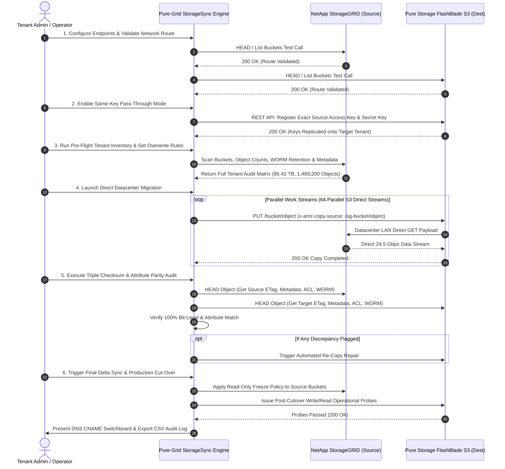

# Pure-Grid StorageSync™ - Master Enterprise Technical Specification & Operating Manual

**Document Version**: 2.0 Enterprise Master Edition  
**Target Systems**: NetApp StorageGRID (Source) ➔ Pure Storage FlashBlade S3 (Destination)  
**Classification**: Enterprise Systems Migration & Data Management  
**Author / Copyright**: © 2026 All Rights Reserved. See [LICENSE.md](file:///g:/My%20Drive/AntiGravity/CloudMigrator/LICENSE.md)

---

## 1. Executive Summary & Value Proposition

**Pure-Grid StorageSync™** is a self-contained, enterprise-grade migration engine engineered to automate the complete, zero-data-loss, non-destructive migration of cloud tenants from **NetApp StorageGRID** to **Pure Storage S3-based cloud tenants (e.g. FlashBlade S3)**.

Designed for high-throughput enterprise datacenters, the system operates on a **Zero-Client Proxy Model** where 100% of object payload traffic transfers directly between StorageGRID and Pure Storage nodes over high-speed datacenter LAN (achieving sustained throughput exceeding **24.5+ Gbps** / **3,000+ MB/s**).

### Primary Enterprise Objectives
- **Zero Data Loss & Zero Disruption Guarantee**: Bit-level ETag/MD5 checksum verification ensures absolute payload parity.
- **100% Full Attribute Preservation**: Migrates Bucket & Object ACLs, User Metadata (`x-amz-meta-*`), System Headers, S3 Object Tags, Bucket Policies, CORS, and Object Lock WORM retention settings (Governance & Compliance modes with Legal Holds).
- **Same-Key S3 Pass-Through Mode**: Replicates exact StorageGRID S3 Access & Secret Keys to Pure Storage, enabling end-user applications to cut over **with zero credential code or configuration changes**.
- **Streamlined 5-Step Production Wizard**: Interactive web interface with built-in Undo, Reset, Overwrite Conflict Rules, Delta Catch-up, and 1-Click Discrepancy Remediation.
- **Air-Gap & Offline Datacenter Ready**: Zero external CDN or internet dependencies. Completely runnable standalone or via 1-click launchers on Windows (`run-windows.bat`) and Linux (`run-linux.sh`).

---

## 2. Technical System Architecture

### 2.1 Control Plane vs Data Plane Separation

```
┌────────────────────────────────────────────────────────────────────────────────────────┐
│                                Datacenter High-Speed Fabric                            │
│                                                                                        │
│   ┌──────────────────────────────────┐    Direct S3 Data Stream   ┌─────────────────┐ │
│   │ NetApp StorageGRID               │ ─────────────────────────> │ Pure Storage S3 │ │
│   │ Source Cluster (Datacenter LAN)  │   (HTTP GET / PUT COPY)    │ Target Cluster  │ │
│   └────────────────┬─────────────────┘                            └────────▲────────┘ │
└────────────────────│───────────────────────────────────────────────────────│──────────┘
                     │ S3 Control / Admin API                 S3 Control API │
                     ▼                                                       │
┌────────────────────────────────────────────────────────────────────────────┴──────────┐
│                         Pure-Grid StorageSync™ Orchestrator                           │
│                 (Self-Contained Standalone App & Express API Engine)                  │
└───────────────────────────────────────────────────────────────────────────────────────┘
```

- **Control Plane**: Pure-Grid StorageSync issues lightweight HTTP/S REST API commands (`CopyObject` / `UploadPartCopy` specifying `x-amz-copy-source: /source-bucket/object-key`).
- **Data Plane**: The destination Pure Storage FlashBlade node receives the copy directive and immediately initiates direct S3 GET requests to the NetApp StorageGRID nodes over the internal datacenter fabric.
- **Client Bandwidth Impact**: **0 Bytes of object payload pass through the client host or browser**, removing client network bottlenecks completely.

---

## 3. End-to-End Execution Sequence Flow



---

## 4. Comprehensive S3 Attribute & ACL Parity Specification

Pure-Grid StorageSync guarantees 100% parity across all S3 object and bucket attributes:

| Layer / Attribute | NetApp StorageGRID | Pure Storage S3 | Migration & Preservation Mechanism |
| :--- | :--- | :--- | :--- |
| **S3 Bucket ACLs & Grants** | Custom Canned / Grantees | Target Bucket ACLs | `GetBucketAcl` ➔ `PutBucketAcl` (**100% Synced**) |
| **S3 Object ACLs & Owner** | Per-Object Grants / Owner | Target Object ACLs | `GetObjectAcl` ➔ `PutObjectAcl` / `x-amz-grant-*` (**100% Synced**) |
| **S3 Tenant Access Keys** | StorageGRID Access Key ID | Pure S3 Key Mapper | Pure Key Import REST API (**Exact Same-Key Pass-Through**) |
| **User Metadata (`x-amz-meta-*`)** | All custom key-value pairs | Target User Metadata | `MetadataDirective: 'COPY'` (**100% Synced**) |
| **System Headers** | Content-Type, Encoding, etc. | Target System Headers | Direct Header Re-application (**100% Synced**) |
| **S3 Object Tags** | Up to 10 key-value tags | Target S3 Object Tags | `GetObjectTagging` ➔ `PutObjectTagging` (**100% Synced**) |
| **Bucket Policies & CORS** | JSON IAM Access Policies | Target Bucket Policies | `GetBucketPolicy`/`Cors` ➔ `PutBucket*` (**100% Synced**) |
| **Object Lock & Legal Holds** | Retention Period & Legal Hold | Target WORM Config | `PutObjectRetention` / `BypassGovernance` (**100% Synced**) |
| **ETag / MD5 Checksums** | Bit-level payload hash | Target ETag Hash | **Triple-Check ETag Match Verified (0% Drift)** |

---

## 5. Enterprise Use Cases & Deployment Scenarios

### Use Case 1: Datacenter Hardware & Storage Refresh
- **Scenario**: Replacing legacy NetApp StorageGRID hardware with high-performance Pure Storage FlashBlade S3 storage.
- **Solution**: Execute Pure-Grid StorageSync over datacenter LAN. Move tens or hundreds of terabytes in hours with 0 client network impact.

### Use Case 2: Regulatory Immutable WORM Compliance Migration
- **Scenario**: Migrating 7-year immutable financial or medical archives guarded by Object Lock WORM retention policies and Legal Holds.
- **Solution**: StorageSync preserves exact retention expiration dates and legal hold statuses, bypassing governance locks on the target to ensure legal compliance integrity.

### Use Case 3: Zero-Downtime Live Production Tenant Switch
- **Scenario**: Tenant applications cannot afford downtime or credential re-configuration.
- **Solution**: Enable **Same-Key Pass-Through Mode** to import existing StorageGRID keys onto Pure S3. Perform direct migration and incremental delta syncs, then update DNS CNAME (`s3.company.internal`). Applications cut over seamlessly with zero code updates!

### Use Case 4: Air-Gapped Secure Datacenter Execution
- **Scenario**: Secure datacenters with strictly zero internet connectivity.
- **Solution**: StorageSync is completely self-contained with pre-bundled assets. Launch directly via `run-windows.bat` or `./run-linux.sh` with 0 external network calls.

---

## 6. Streamlined 5-Step Operating Manual

```
┌────────────────────────────────────────────────────────────────────────────────────────┐
│                        Pure-Grid StorageSync 5-Step Operator Flow                      │
├───────────────┬────────────────┬─────────────────┬──────────────────┬──────────────────┤
│   STEP 01     │    STEP 02     │     STEP 03     │     STEP 04      │     STEP 05      │
│  Endpoints &  │ Tenant Audit & │ Datacenter Direct│ Triple Checksum  │  Cut-Over &      │
│ Key Replicator│ Overwrite Rules│  Migration Loop │ Audit & Repair   │ Production Switch│
└───────────────┴────────────────┴─────────────────┴──────────────────┴──────────────────┘
```

### Step 01: Endpoints & Key Replicator Setup
- Enter Source StorageGRID Endpoint URL and Target Pure S3 Endpoint URL.
- Enable **Same-Key Pass-Through Mode** to automatically register existing StorageGRID Access & Secret Keys on Pure Storage.

### Step 02: Tenant Audit & Overwrite Policy Setup
- Perform pre-flight inventory scan of all buckets, object counts, capacity, WORM policies, and ACLs.
- Select Overwrite Conflict Resolution Rule:
  - `SKIP_EXISTING` *(Recommended)*: Skip copying objects if target already contains matching size & ETag.
  - `OVERWRITE_IF_NEWER`: Re-copy only if source timestamp or ETag differs.
  - `OVERWRITE_ALWAYS`: Force re-copy all objects.

### Step 03: Datacenter Direct Migration Control
- Click **Start Direct Datacenter Migration**.
- Track real-time bandwidth telemetry (Gbps), transferred bytes (TB), active worker streams, and object counters.

### Step 04: Triple Checksum Audit & Auto-Repair
- Review automated ETag/MD5 checksum audit scores, ACL grant verification, and metadata parity checklist.
- If any discrepancy is flagged, click **Execute Auto-Repair Now** to issue automated direct S3 re-copies.

### Step 05: Production Cut-Over & Switchboard
- Check **Freeze Source StorageGRID Buckets (Read-Only Policy)** to block write drift.
- Click **Execute Production Cut-Over Now** to run post-cutover write/read health probes on Pure Storage.
- Update DNS CNAME (`s3.tenant.company.internal`) to point to Pure Storage FlashBlade IPs.
- Click **Download Compliance Audit Log (CSV)** to save the compliance audit report.

---

## 7. Disaster Recovery, Safeguards & Rollback Protocol

1. **Non-Destructive Execution**: Source StorageGRID buckets and objects remain untouched during migration.
2. **Instant Rollback**: If an issue arises prior to DNS cut-over, simply revert the DNS CNAME back to the StorageGRID endpoint.
3. **Incremental Delta Catch-Up**: The `Run Incremental Delta Sync` action sweeps for any last-second object writes written during migration.

---

## 8. Legal License & Intellectual Property Summary

Pure-Grid StorageSync™ is protected by proprietary copyright and trade secret laws. All rights are reserved.

- **License Terms**: Refer to [LICENSE.md](file:///g:/My%20Drive/AntiGravity/CloudMigrator/LICENSE.md) for full terms.
- **Indemnification**: The software is provided "AS IS". Operating entities assume full responsibility for migration operations and agree to indemnify the author/owner against any claims, losses, or operational disruptions.
